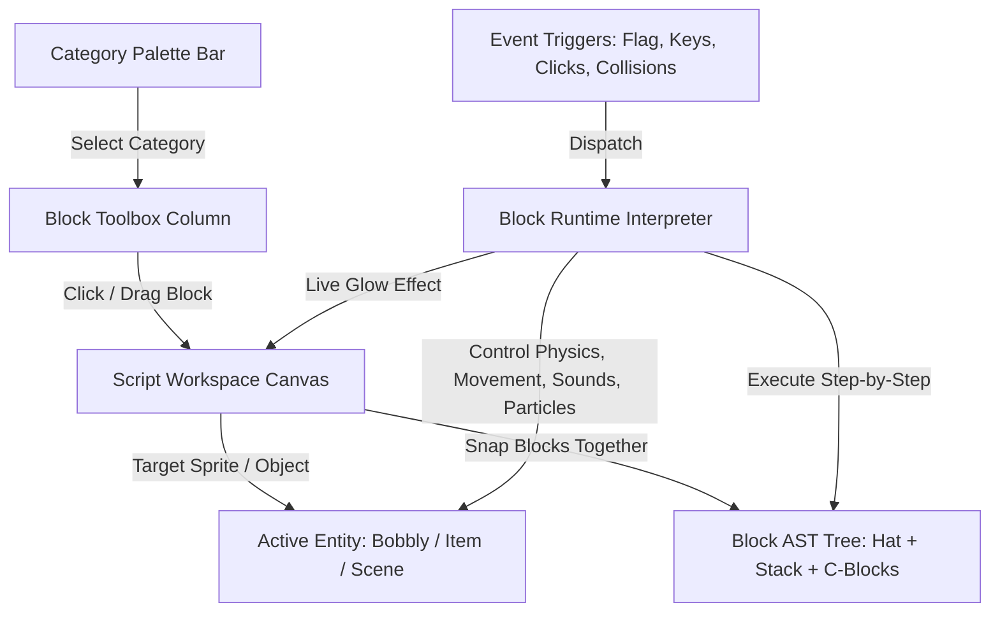

# Scratch 3.0-Style Visual Block Scripting System

Build a full Scratch 3.0-grade visual block programming environment directly integrated into **UNIFIVE**, allowing users to snap together puzzle blocks (Events, Motion, Looks, Sound, Control, Sensing) to program Bobbly and any placed objects in the world.

---

## 1. Scratch 3.0 Architecture Overview

---

## 2. Key Features to Implement

### A. Scratch Category Palette & Block Toolbox (Left Sidebar)
- **Categories with authentic Scratch colors & Phosphor icons**:
  - 🟡 **Events** (`#FFBF00` / `#FFAB19`): `when 🚩 clicked`, `when [space] key pressed`, `when this sprite clicked`, `when touching [object]`, `when bobbly jumps`, `when lands on [ground]`.
  - 🔵 **Motion & Physics** (`#4C97FF`): `move (10) steps`, `change x by (10)`, `change y by (10)`, `jump with force (12)`, `bounce / launch (15)`, `point in direction (90)°`, `turn ↻ (15) deg`, `go to [random position]`, `set isSolid to [true/false]`.
  - 🟣 **Looks & FX** (`#9966FF`): `say [Hello!] for (2) secs`, `change color effect by (25)`, `flash color [gold]`, `set size to (100)%`, `show`, `hide`, `spawn particles [sparks/smoke]`.
  - 🟣 **Sound & Music** (`#D65CD6`): `play sound [jump/pop/chime]`, `play tone (440) Hz for (0.2)s`, `start metronome (120) BPM`.
  - 🟠 **Control & Loops** (`#FFAB19`): `wait (1) secs`, `repeat (10) [ ... ]`, `forever [ ... ]`, `if <condition> then [ ... ]`, `if <condition> then [ ... ] else [ ... ]`, `stop [all / this script]`.
  - 🩵 **Sensing & Conditionals** (`#5CB1D6`): `touching [mouse-pointer / Bobbly / object]?`, `key [space] pressed?`, `distance to [bobbly] < (100)`.

### B. True Scratch Puzzle-Block Geometry & Aesthetics
- **Hat Blocks**: Curved arch on top with bottom puzzle tab/peg.
- **Stack Blocks**: Top puzzle notch indent + bottom puzzle tab/peg with editable number/text bubbles and dropdowns.
- **C-Blocks (Wrappers)**: Top/bottom tabs with an expandable inner slot that holds nested block stacks (for `forever`, `repeat`, `if <...> then`).
- **Condition / Reporter Pills**: Hexagonal/diamond condition blocks that nest into `if` slots.
- **Active Execution Glow**: When scripts are running, connected stacks illuminate with a bright golden/yellow pulse outline just like Scratch.

### C. Workspace Canvas & Sprite Selector
- **Interactive Workspace**:
  - Drag and drop blocks freely in 2D space.
  - Automatic snapping when blocks are dropped near existing block tabs.
  - Zoom in (`+`), Zoom out (`-`), and Reset (`=`) controls.
  - Target sprite watermark/icon in the top right.
- **Sprite / Object Switcher**:
  - Seamlessly switch between programming **Bobbly Companion**, **Global Scene**, or any individual **Placed Object / Stamp**.
  - Each entity has its own independent script stack collection.

### D. Live Block Interpreter & Runtime
- Handles sequential block execution, loops (`repeat`, `forever` with `requestAnimationFrame` yielding), conditionals (`if touching`), and event triggers.
- Integrates directly with `bobblyCompanion`, `WorldState.items`, `CollisionEngine`, sound synthesis, and particle effects.

---

## 3. Proposed Changes

### [NEW] [js/scratch_blocks.js](file:///c:/Users/peter/Documents/p5/code/js/scratch_blocks.js)
- Core Scratch visual block definitions, SVG/HTML rendering utilities, block stack AST builder, drag-and-drop snap manager, and the step-by-step block interpreter.

### [MODIFY] [index.html](file:///c:/Users/peter/Documents/p5/code/index.html)
- Integrate the Scratch-style 3-column layout inside the Script Screen tab (Category navigation dots, Block Toolbox drawer, Main Script Workspace with Zoom controls and Target badge).
- Include ``.

### [MODIFY] [style.css](file:///c:/Users/peter/Documents/p5/code/style.css)
- Comprehensive CSS styles for authentic Scratch puzzle blocks:
  - SVG/CSS notch geometry and clipping paths.
  - Category palette pill navigation.
  - Nested C-block slot layouts and indentations.
  - Input bubble styling and dropdown arrows.
  - Drag ghosting, snap highlight indicators, and active glowing execution frames.

### [MODIFY] [sketch.js](file:///c:/Users/peter/Documents/p5/code/sketch.js)
- Hook Scratch Block Interpreter into `draw()` loop and event listeners (`startPlay()`, `keyPressed()`, `mousePressed()`, `bobblyCompanion.jump()`, collision callbacks).
- Synchronize sprite/object selection between the canvas stage and the Scratch block workspace.

---

## 4. Verification Plan

### Automated / Syntax Tests
- Run `node -c` on all JavaScript files (`js/scratch_blocks.js`, `sketch.js`, `js/actions.js`, `js/companion.js`, etc.) to guarantee 0 syntax or runtime errors.

### Manual & Interactive Verification
- **Drag & Snap**: Add `when 🚩 clicked` -> `move (10) steps` -> `if <touching object> then [ bounce / jump ]`.
- **Green Flag Execution**: Click Green Flag and verify that blocks light up with the execution glow and Bobbly/objects execute the programmed behaviors.
- **Key Press Trigger**: Snap `when [space] key pressed` -> `spawn particles [sparks]` and press spacebar to see live sparks and sound.
- **Multi-Sprite Programming**: Select a placed tree or rectangle, attach `forever [ turn ↻ (5) degrees ]`, and observe the object rotate continuously.
